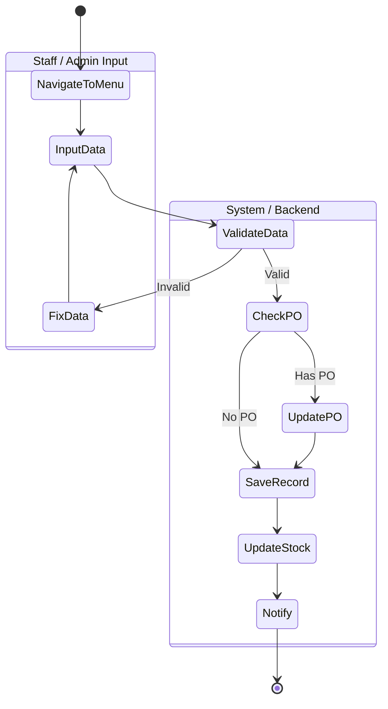
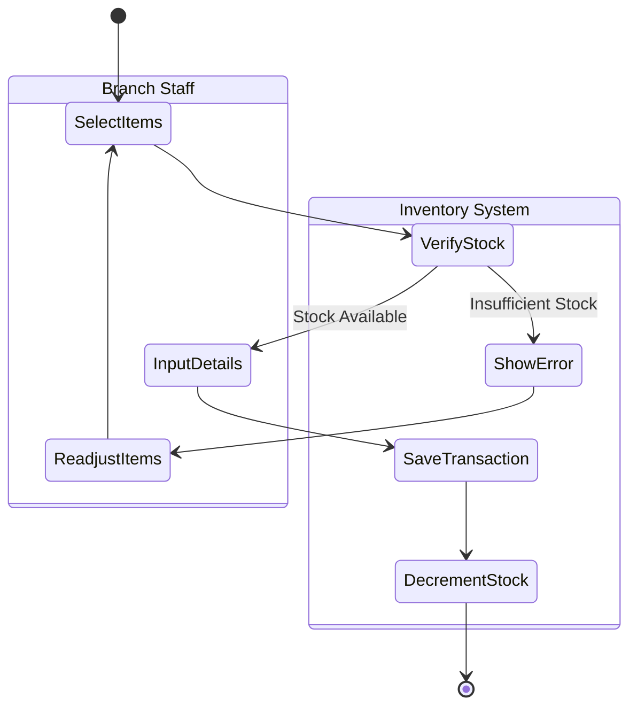
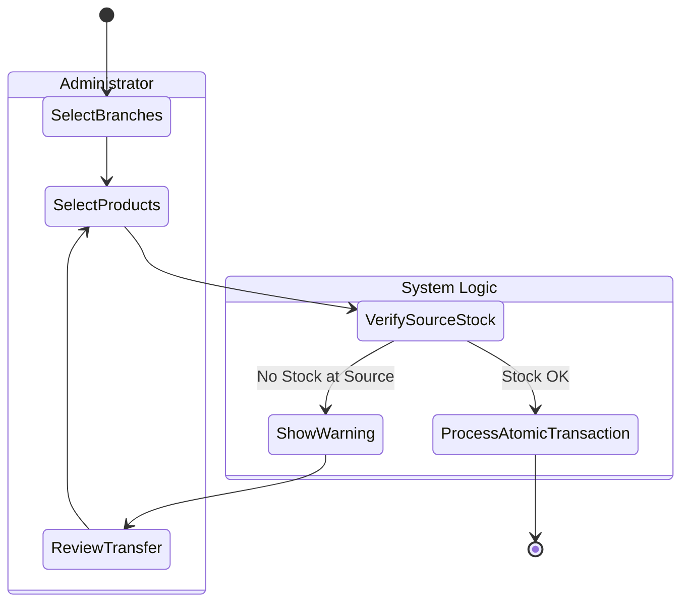
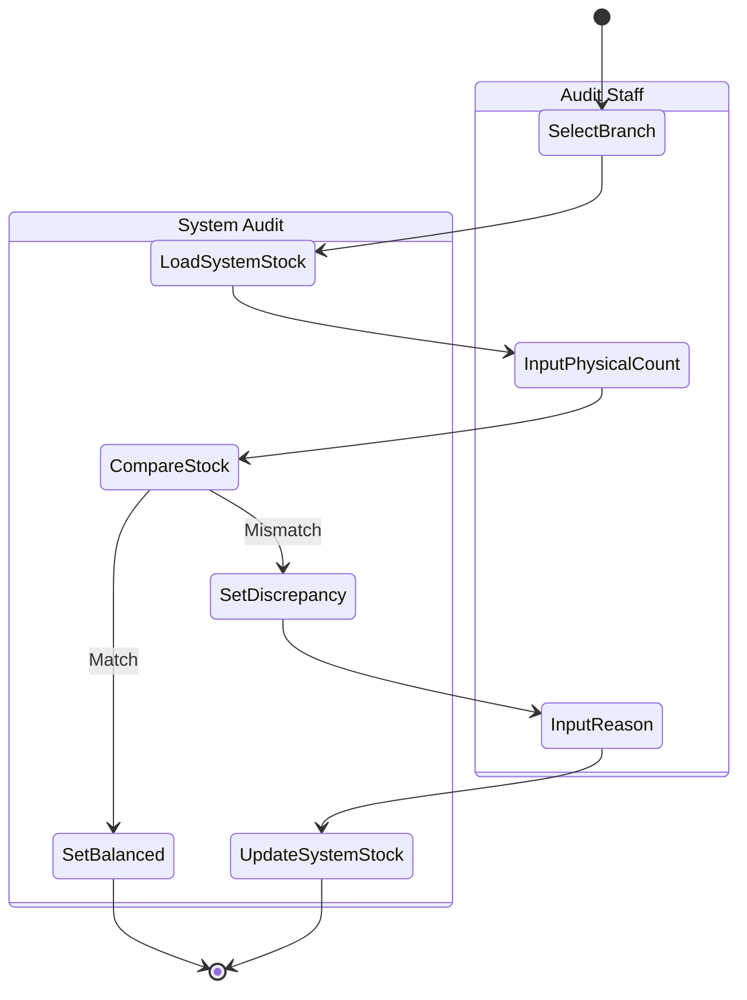
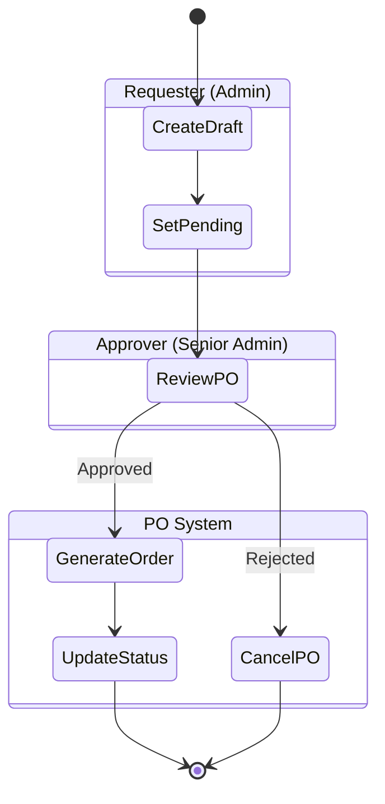

# HighCloud VapeStore - Activity Diagrams (State-Swimlane Mapping)

This document outlines the operational workflows using Mermaid.js `stateDiagram-v2` syntax. We utilize **Composite States** to act as "Tables" or "Swimlanes", perfectly dividing responsibilities between the User and the System while maintaining the formal state diagram aesthetics.

## 1. Stock In Process (Barang Masuk)

---

## 2. Stock Out Process (Barang Keluar)

---

## 3. Stock Transfer (Inter-branch)

---

## 4. Stock Opname (Penyesuaian Stok)

---

## 5. Purchase Order (Pemesanan Barang)

