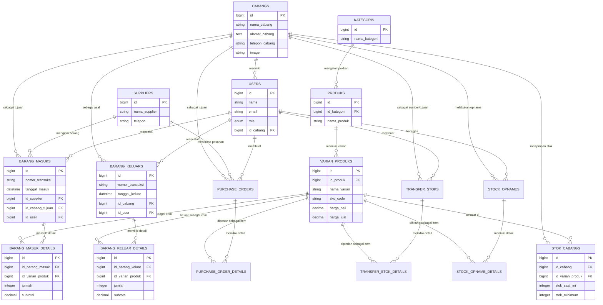

# 📊 Entity Relationship Diagram (ERD) - HighCloud VapeStore

Dokumen ini berisi visualisasi struktur database inti untuk sistem **HighCloud VapeStore**. Diagram ini berfokus pada logika bisnis utama seperti manajemen stok, transaksi barang masuk/keluar, dan operasional cabang.

## 1. Diagram Mermaid

## 2. Penjelasan Singkat Relasi & Logika Laporan

Diagram di atas menggambarkan bagaimana data mengalir di dalam HighCloud VapeStore:

1.  **Struktur Produk**: Produk dikelola melalui hierarki `Kategori` -> `Produk` -> `Varian Produks`. Hal ini memungkinkan satu produk (misal: Liquid A) memiliki banyak varian (misal: Nikotin 3mg, 6mg).
2.  **Manajemen Stok**: Tabel `Stok Cabangs` adalah tabel persimpangan (*pivot*) antara `Cabang` dan `Varian Produk`. Laporan Sisa Stok sangat bergantung pada relasi ini untuk menunjukkan sisa barang di tiap lokasi.
3.  **Alur Transaksi**:
    - **Barang Masuk**: Menghubungkan `Supplier` (asal) ke `Cabang` (tujuan). Detail item dicatat di `Barang Masuk Details`.
    - **Barang Keluar (Penjualan)**: Mencatat pengurangan stok dari suatu `Cabang`. Detail item dicatat di `Barang Keluar Details`.
    - **Stock Opname**: Digunakan untuk sinkronisasi fisik antara stok di gudang/toko dengan stok di sistem.
4.  **Audit Trail**: Melalui relasi ke tabel `Users`, sistem dapat melacak siapa petugas yang bertanggung jawab atas setiap transaksi (pencatat barang masuk, kasir barang keluar, atau petugas opname).

Diagram ini menjadi fondasi utama dalam pembuatan modul **Laporan** di Filament, di mana setiap query laporan akan melakukan *join* ke tabel-tabel terkait berdasarkan foreign key yang didefinisikan di atas.
