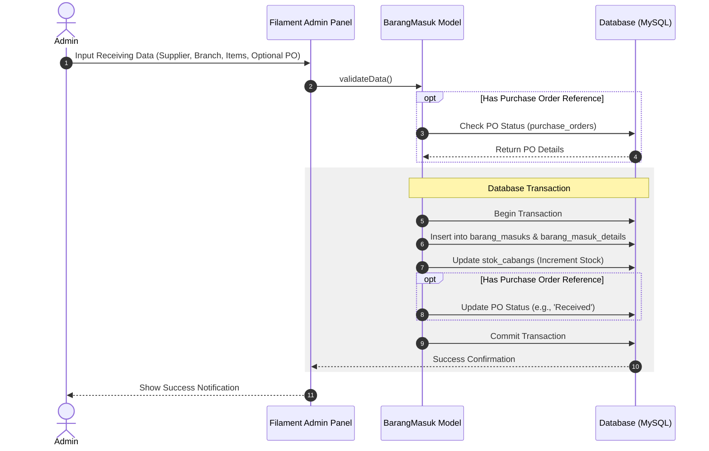
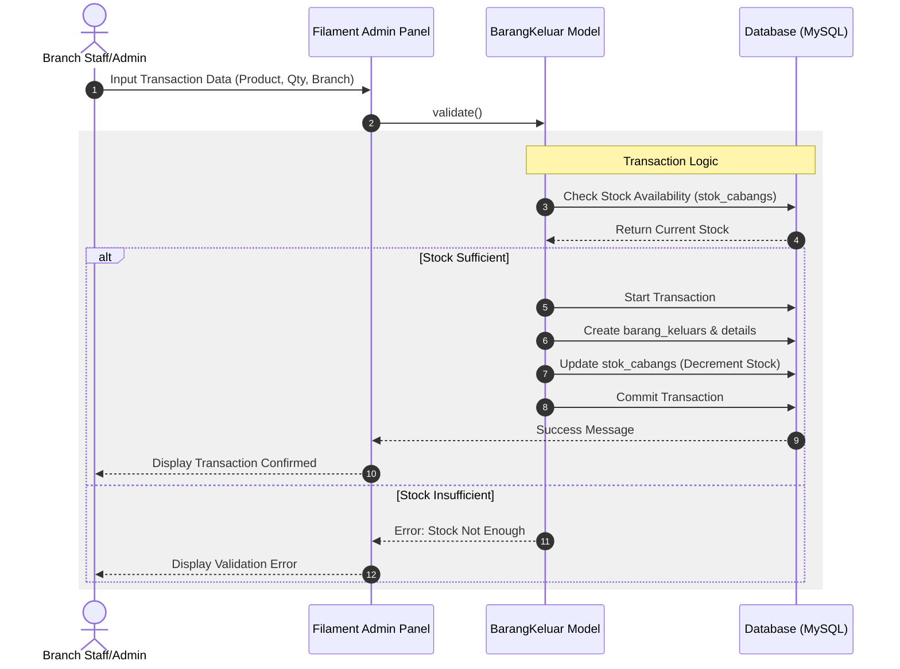
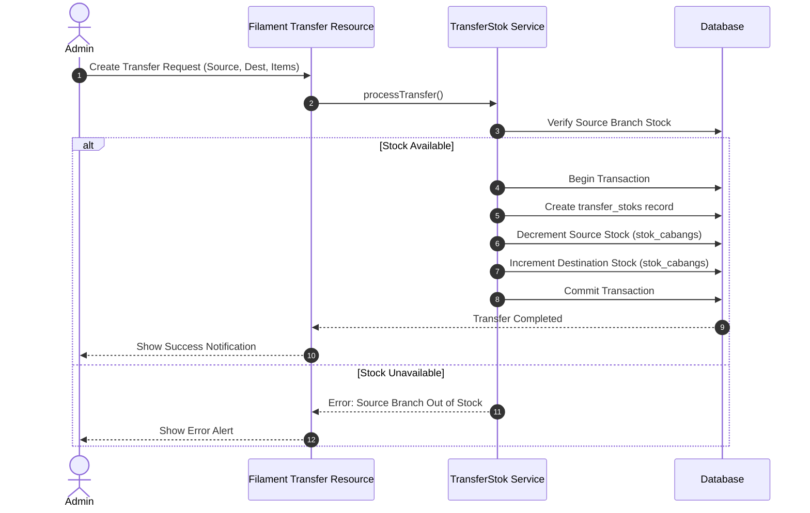
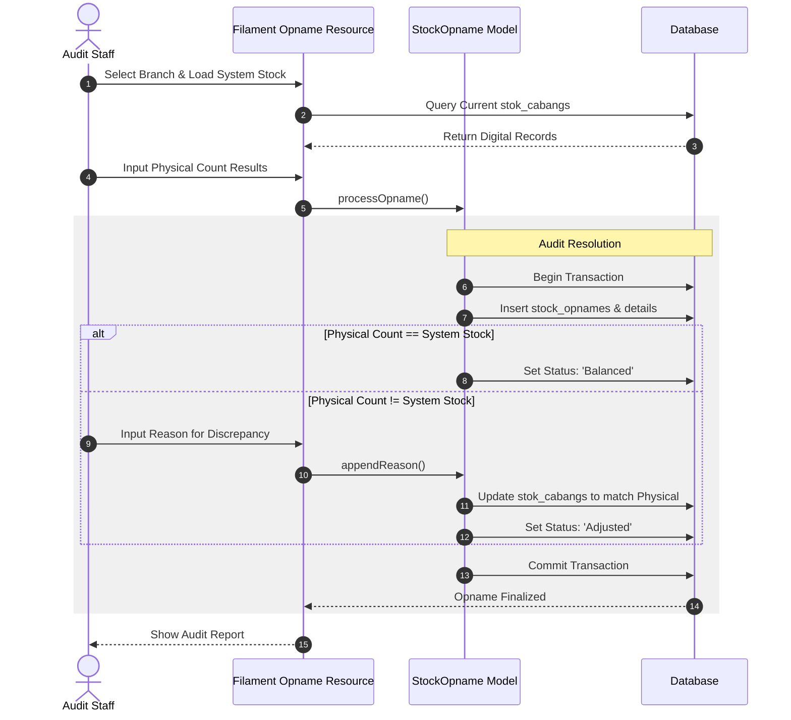
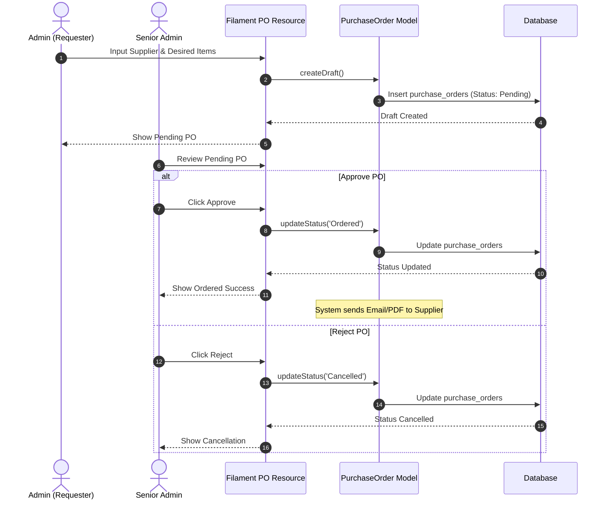

# HighCloud VapeStore - Sequence Diagrams

This document outlines the core business processes of the HighCloud VapeStore Inventory System using Mermaid.js Sequence Diagrams. It details the exact interactions between Actors (Users), the User Interface (Filament), Backend Models/Services, and the Database.

## 1. Stock In Process (Barang Masuk)

This diagram illustrates the process of recording incoming stock from suppliers, including optional integration with existing Purchase Orders.

### Breakdown: Stock In
1. **Input & Validation**: Admin inputs received items.
2. **PO Integration**: If linked to a PO, the system fetches it to sync statuses.
3. **Atomic Transaction**: Ensures that the `barang_masuks` record and the `stok_cabangs` increment happen together.
4. **PO Status Sync**: Marks the corresponding Purchase Order as fulfilled if applicable.

---

## 2. Stock Out Process (Barang Keluar)

This diagram illustrates the process of recording a stock-out (sale/usage) through the Filament Admin Panel.

### Breakdown: Stock Out
1. **Input Data**: Staff enters product details, quantity, and branch context.
2. **Stock Check**: The system queries `stok_cabangs` to ensure the specific branch has enough stock.
3. **Database Transaction**: If sufficient, stock is decremented and the log is saved atomically. Prevents negative stock.

---

## 3. Stock Transfer Process (Antar Cabang)

This diagram shows how stock is securely moved from one branch to another without data loss.

### Breakdown: Stock Transfer
1. **Verification**: System ensures the source branch actually holds the stock being transferred.
2. **Double Mutation**: Using a single transaction, the system deducts from the source and adds to the destination, preventing "lost in transit" digital discrepancies.

---

## 4. Stock Opname Process (Penyesuaian Stok)

This diagram details the physical auditing process and how the system rectifies discrepancies.

### Breakdown: Stock Opname
1. **Data Sync**: Auditor loads the system's expected stock values.
2. **Comparison**: The system compares physical counts against system records.
3. **Adjustment**: If a mismatch occurs, a reason must be provided, and the system forcefully updates the database to reflect physical reality, logging the discrepancy.

---

## 5. Purchase Order (Pemesanan Barang)

This diagram covers the workflow of drafting and approving a Purchase Order to a supplier.

### Breakdown: Purchase Order
1. **Drafting**: An initial PO is created with a 'Pending' status. It does not affect stock.
2. **Approval Hierarchy**: A different (or senior) admin reviews the PO.
3. **Finalization**: Upon approval, the PO is marked 'Ordered' and dispatched to the supplier. This PO will later be referenced in the **Stock In** process.
