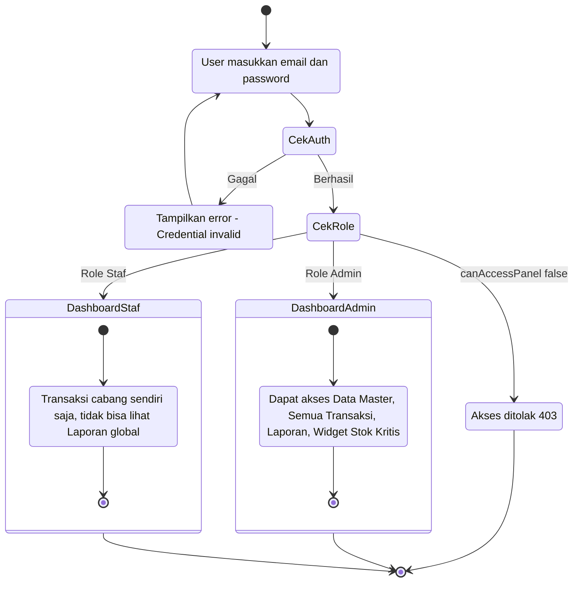
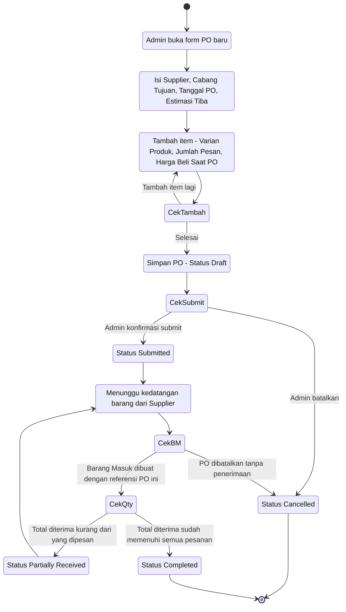
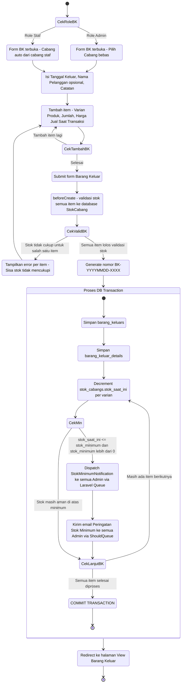
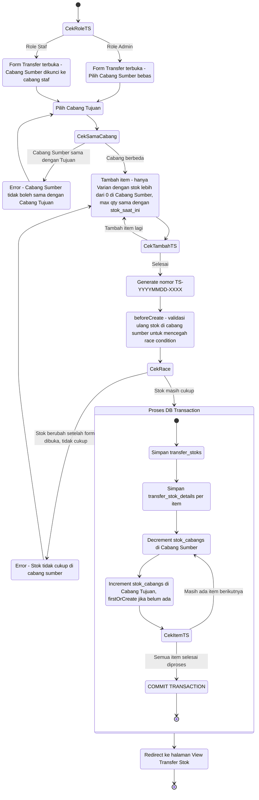
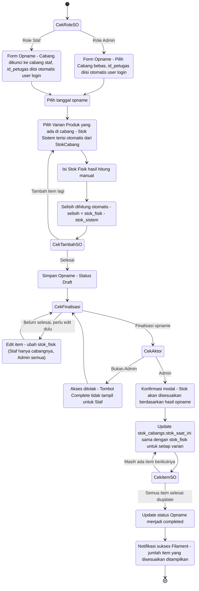

# Highcloud Vapestore — Activity Diagrams

Berdasarkan analisis source code aktual: Models, Filament Resource Pages, Migration, dan Notification.

---

## 1. Login & Role-Based Access Control

---

## 2. Alur Purchase Order (PO)

---

## 3. Alur Barang Masuk (dari Supplier + PO Linking)

```mermaid
stateDiagram-v2
    [*] --> CekRole
    state CekRole <<choice>>
    CekRole --> FormAdmin : Role Admin
    CekRole --> FormStaf : Role Staf

    FormAdmin: Buka form - Pilih Cabang Tujuan bebas
    FormStaf: Buka form - Cabang Tujuan dikunci ke cabang sendiri

    FormAdmin --> PilihSupplier
    FormStaf --> PilihSupplier
    PilihSupplier: Pilih Supplier dan Cabang Tujuan

    PilihSupplier --> CekPO
    state CekPO <<choice>>
    CekPO --> PilihPO : Ada PO aktif untuk Supplier dan Cabang ini
    CekPO --> TambahManual : Tanpa PO atau PO tidak tersedia

    PilihPO: Pilih Nomor PO dengan Status Submitted atau Partially Received
    PilihPO --> AutoFill
    AutoFill: Item terisi otomatis dari sisa qty PO, harga beli dikunci dari PO

    AutoFill --> CekAdjust
    state CekAdjust <<choice>>
    CekAdjust --> EditQty : Perlu adjust jumlah diterima
    CekAdjust --> SubmitBM : Langsung submit

    EditQty: Edit jumlah diterima saja - tidak bisa tambah atau hapus item
    EditQty --> SubmitBM

    TambahManual: Tambah item manual - Varian Produk, Jumlah, Harga Beli
    TambahManual --> CekTambah
    state CekTambah <<choice>>
    CekTambah --> TambahManual : Tambah item lagi
    CekTambah --> SubmitBM : Selesai

    SubmitBM: Submit Barang Masuk
    SubmitBM --> DBTransaksiBM

    state "Proses DB Transaction" as DBTransaksiBM {
        [*] --> GenerateNo
        GenerateNo: Generate nomor BM-YYYYMMDD-XXXX
        GenerateNo --> SimpanBM
        SimpanBM: Simpan barang_masuks
        SimpanBM --> SimpanDetail
        SimpanDetail: Simpan barang_masuk_details
        SimpanDetail --> UpdateStok
        UpdateStok: Tambah stok_cabangs.stok_saat_ini per varian, firstOrCreate jika belum ada
        UpdateStok --> CekLinkPO
        state CekLinkPO <<choice>>
        CekLinkPO --> UpdatePODetail : BM terhubung ke PO
        CekLinkPO --> Commit : BM tidak terhubung PO
        UpdatePODetail: Increment jumlah_diterima di purchase_order_details
        UpdatePODetail --> CekStatusPO
        state CekStatusPO <<choice>>
        CekStatusPO --> POSelesai : Total diterima lebih dari atau sama dengan total dipesan
        CekStatusPO --> POSebagian : Total diterima masih kurang
        POSelesai: Update PO status ke Completed
        POSebagian: Update PO status ke Partially Received
        POSelesai --> Commit
        POSebagian --> Commit
        Commit: COMMIT TRANSACTION
        Commit --> [*]
    }

    DBTransaksiBM --> RedirectBM
    RedirectBM: Redirect ke halaman View Barang Masuk
    RedirectBM --> [*]
```

---

## 4. Alur Barang Keluar (Penjualan + Validasi Stok + Notifikasi)

---

## 5. Alur Transfer Stok Antar Cabang

---

## 6. Alur Stock Opname (Audit & Rekonsiliasi Stok)

---

## Ringkasan Penanda Alur Sistem

| Alur | Trigger | Aktor | Update Stok |
|------|---------|-------|-------------|
| Purchase Order | Manual Admin | Admin | Tidak langsung |
| Barang Masuk | PO linked atau manual | Admin / Staf | Naik di cabang tujuan |
| Barang Keluar | Penjualan | Admin / Staf | Turun di cabang asal |
| Transfer Stok | Kebutuhan antar cabang | Admin / Staf | Turun dari sumber, naik ke tujuan |
| Stock Opname | Audit berkala | Admin / Staf | Override ke stok_fisik saat complete |
| Notif Stok Minimum | Triggered oleh Barang Keluar | Sistem (auto) | Tidak ada, hanya alert |
