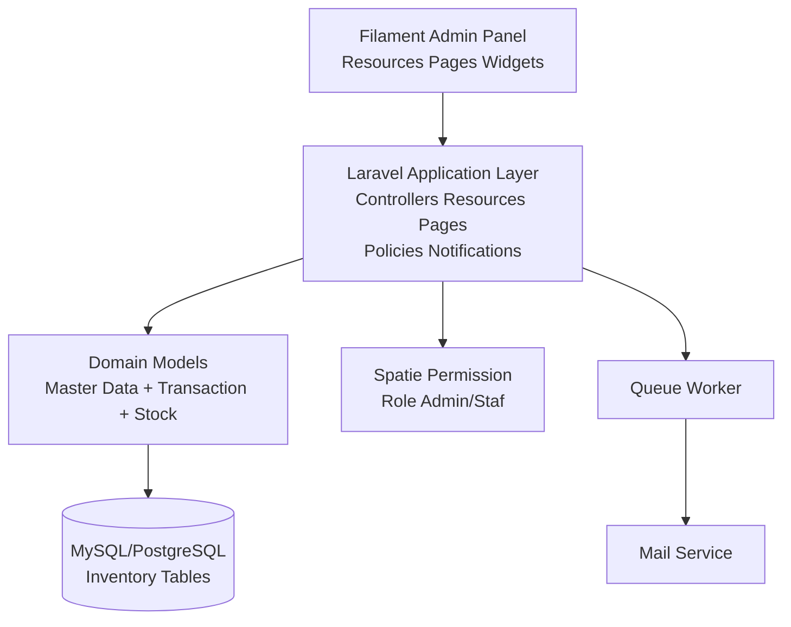
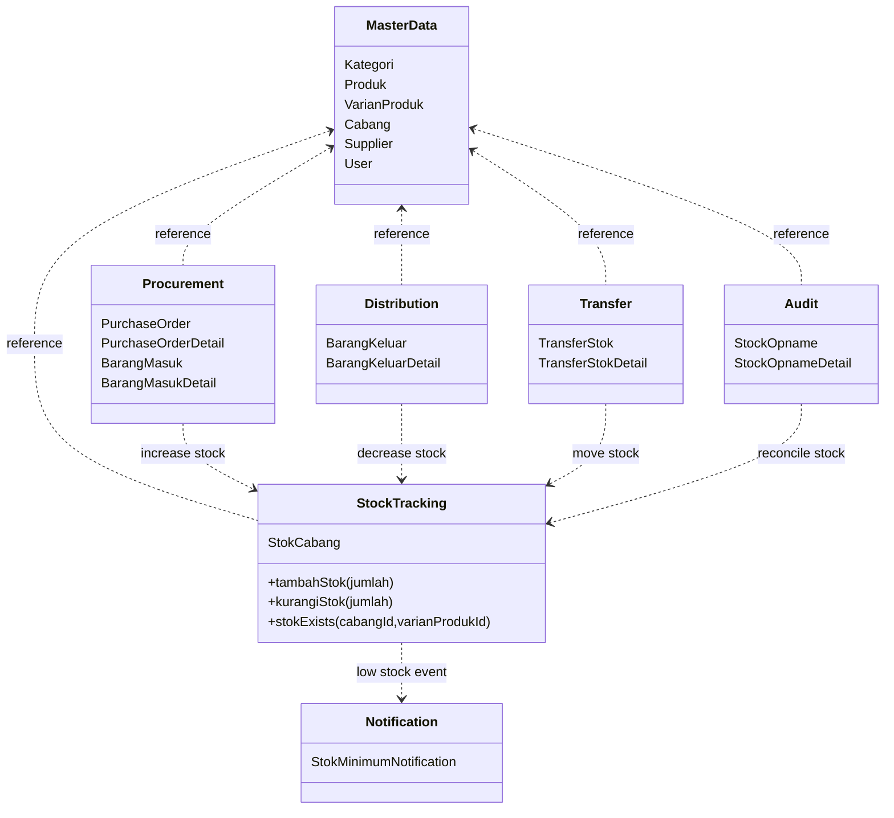
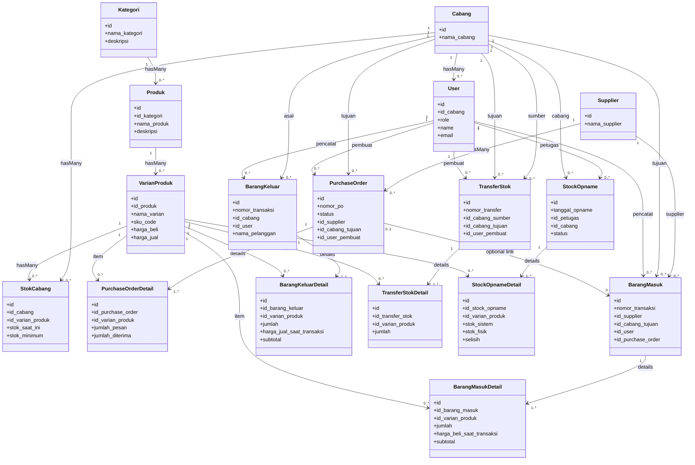
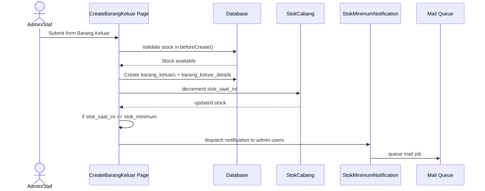

# Highcloud Vapestore UML

Dokumen ini merangkum desain UML berdasarkan analisis source code dan struktur root project Laravel + Filament.

## 1) Architecture Component UML

## 2) Package UML (Bounded Context)

## 3) Domain Class UML (Entity + Cardinality)

## 4) Sequence UML (Transaksi Barang Keluar -> Notifikasi Stok Minimum)

## 5) Catatan Konsistensi yang Perlu Diperhatikan

- Status Purchase Order di migration menggunakan `Submitted`, `Partially Received`, `Completed`, `Cancelled`.
- Di beberapa logika model masih muncul nilai lama berbahasa Indonesia seperti `Dikirim`, `Sebagian Diterima`, `Selesai`.
- Untuk menjaga integritas UML dan implementasi, sebaiknya satu standar status saja dipakai lintas model/resource/migration.

## 6) Source Verifikasi Utama

- app/Models
- app/Filament/Resources
- app/Filament/Resources/*/Pages
- app/Filament/Pages
- app/Filament/Widgets
- app/Notifications/StokMinimumNotification.php
- database/migrations/2025_10_28_033238_create_inventory_tables.php
- database/migrations/2025_10_29_030119_create_barang_masuk_tables.php
- database/migrations/2025_10_29_135842_create_barang_keluar_tables.php
- database/migrations/2025_10_30_033520_create_purchase_order_tables.php
- database/migrations/2025_11_01_064307_create_transfer_stock_tables.php
- database/migrations/2025_11_12_090127_create_stock_opname_tables.php
